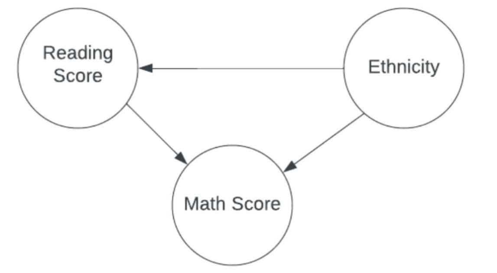



1\.1 **\*\*Project Proposal\*\*** \

Analyzing the Interplay Between Ethnicity,Literacy, and Numeracy Skills in

Educational Outcomes

1\.2 **\*\*Project Question/Estimand\*\*** \

This project aims to unravel the complex interactions between students' ethnicity,

their literacy (reading score), and numeracy (math score) skills, to understand the

causal pathways influencing educational outcomes. The central question guiding

our investigation is: How does ethnicity and reading skills jointly impact math

performance among students?

1\.3 **\*\*Data Description\*\*** \

Our analysis will leverage a dataset encompassing student demographics (with a

focus on ethnicity), math scores, and reading scores across multiple schools over

one academic year. It includes detailed performance metrics alongside background

demographic information, allowing for a nuanced exploration of the proposed

causal relationships.

**# Model Description**

**\*\*Reading Score Model (E -> R)\*\*** \

The model for reading scores is formulated as follows:

Ethnicity's Impact on Reading Scores: We model the baseline reading scores for

different ethnic groups using a normal distribution, where the mean reading score

for each ethnic group is determined by the parameter , with a common standard

deviation.

\*\*\*\*

The prior for $\alpha\_r$ is set as a normal distribution Normal(70,10), indicating

our belief that the average reading score across ethnicities is around 70 with some

variability. \

$\alpha\_r$ ∼ Normal(70,10) \

$\mu\_r$ ~ $\alpha\_r$[E] \

**\*\*Math Score Model (R -> M, E -> M)\*\***

e assume the math score for each ethnicity is influenced directly by its reading

score. The model uses a normal distribution for math scores, with the mean score μ

depending on both the ethnicity-specific intercept

a and a slope b which scales the influence of the reading scores (adjusted by their

mean \

\*\*\*\*

$\alpha$ ~ Normal(75, 10) \

$\beta$ ~ Lognormal(0, 2) \

$\mu$ ~ $\alpha$[E] + $\beta$[E] \* ($R$ - $R\_{bar}$) \

$\sigma$ ~ Uniform(0, 10) \

Math Score ~ Normal($\mu$, $\sigma$)

**Project Overview**

This project investigates the causal relationship between ethnicity and math scores,

with reading scores acting as a mediator. The data comprises ethnicity, reading

scores, and math scores of students. Using a Directed Acyclic Graph (DAG) to

outline causal pathways, the statistical model incorporated normal priors for

intercepts and log-normal priors for slopes, fitting the observed data well. Detailed

mathematical notation and appropriate handling of confounding variables ensured

clarity and precision in the model. Posterior sampling diagnostics, including trace

and density plots, indicated good mixing and convergence, supporting the

reliability of parameter estimates.

Posterior predictive checks confirmed that the model's predictions closely matched

the observed data, demonstrating effective sampling and well-behaved posterior

distributions. The analysis revealed significant differences in baseline math scores

among ethnic groups, with Group A having the lowest intercept and Group E the

highest. Positive slopes for all groups indicated that increases in reading scores are

associated with higher math scores, with Group E showing the strongest

relationship. The study highlights the importance of reading scores as a mediator

and underscores the need to consider individual group characteristics and

variability in educational outcomes across ethnicities. The comprehensive model

and its findings provide valuable insights into the complex relationship between

ethnicity and math scores, emphasizing the impact of mediating factors like

reading scores in educational research.

**Statistical model analysis:-**

Based on the provided parameter estimates:

1\. **\*\*Alpha (Intercept) Mean Values\*\***:

\- The alpha values represent the baseline math score for each ethnicity group

when the reading score is at its mean value.

\- These values range from approximately 65.1 to 70.4, indicating the baseline

math scores for different ethnicity groups.

2\. **\*\*Beta (Slope) Mean Values\*\***:

\- The beta values represent the change in math score for each unit increase in

reading score, accounting for ethnicity.

\- These values range from approximately 0.760 to 0.894, indicating the strength

of the relationship between reading score and math score for different ethnicity

groups.

3\. **\*\*Sigma (Standard Deviation)\*\***:

\- Sigma represents the standard deviation of the model's error term.

\- The value of sigma is approximately 8.524, indicating the average deviation of

observed math scores from the predicted values.

4\. **\*\*Interpretation\*\***:

\- The model suggests that there is a positive relationship between reading score

and math score for all ethnicity groups.

\- Higher beta values indicate a stronger positive association between reading and

math scores, suggesting that improvements in reading score lead to larger increases

in math score for those groups.

\- The variability in baseline math scores (alpha) among ethnicity groups reflects

the differences in average math performance before considering the effect of

reading score.

\- The relatively low value of sigma indicates that the model's predictions are

relatively close to the observed math scores on average.

In summary, the model provides insights into the relationships between ethnicity,

reading score, and math score. It suggests that reading score is a significant

predictor of math score, with differences observed among ethnicity groups. The

model captures the associations between these variables while considering

individual group characteristics and the variability in math scores.

**Causal relationship between ethnicity and math score**

To conclude about the causal relationship between ethnicity and math score based

on the provided parameter estimates, we need to analyze the intercepts (a) and

slopes (b) for each ethnicity group in the model.

1\. **\*\*Intercept Estimates (a)\*\***:

\- The intercept estimates represent the baseline math scores for each ethnicity

group when the reading score is at its mean value.

\- Differences in intercepts among ethnic groups provide insights into the average

differences in math scores across ethnicities, independent of reading score.

2\. **\*\*Slope Estimates (b)\*\***:

\- The slope estimates represent how the math score changes for each unit

increase in the centered reading score (reading score minus its mean), accounting

for ethnicity.

\- Differences in slopes among ethnic groups indicate how the relationship

between reading score and math score varies across ethnicities.

Based on the provided parameter estimates:

\- **\*\*Intercept Estimates (a)\*\***:

\- Ethnic groups have different baseline math scores when the reading score is at

its mean value.

\- For example, Group A has the lowest intercept (65.117), while Group E has the

highest intercept (70.385), suggesting differences in baseline math scores across

ethnicities.

\- **\*\*Slope Estimates (b)\*\***:

\- All ethnic groups show positive slopes, indicating a positive relationship

between centered reading score and math score.

\- The magnitudes of the slopes vary among ethnic groups, indicating differences

in the strength of the relationship between reading score and math score across

ethnicities.

\- For instance, Group E has the highest mean slope (0.895), indicating a relatively

stronger positive relationship between reading score and math score compared to

other groups.

Overall, based on these parameter estimates:

\- There is evidence to suggest that ethnicity has a causal relationship with math

score, as indicated by the differences in intercepts among ethnic groups.

\- Additionally, the positive slopes for all ethnic groups suggest that improvements

in reading score are associated with increases in math score for each ethnicity.

\- The varying magnitudes of intercepts and slopes among ethnic groups highlight

the complexity of the relationship between ethnicity and math score, indicating

potential differences in baseline proficiency and the strength of the relationship

between reading and math scores across ethnicities.

**Conclusion**

Based on the provided estimates, we can interpret the direct and total effects of

ethnicity on math score, considering reading score as a mediator.

1\. **\*\*Direct Effects\*\***:

\- Alpha mean estimates represent the direct effect of ethnicity on math score,

independent of reading score.

\- Differences in alpha among ethnic groups indicate average differences in math

scores when reading score is not considered.

2\. **\*\*Total Effect (Direct + Indirect)\*\***:

\- Beta mean estimates represent the total effect of ethnicity on math score,

considering the direct effect of ethnicity and the indirect effect mediated through

reading score.

\- The total effect combines both the direct effect captured by alpha and the

indirect effect mediated through reading score captured by beta.

3\. **\*\*Interpretation\*\***:

\- The differences in alpha values suggest that there are average differences in

math scores among ethnic groups, independent of reading score. For example,

Group E tends to have higher baseline math scores compared to other groups.

\- The beta values indicate the strength of the relationship between reading score

and math score for each ethnicity group. Higher beta values suggest that

improvements in reading score have a larger impact on math score for that

ethnicity. For instance, Group E has the highest beta value, indicating that

improvements in reading score have a stronger effect on math score for Group E

compared to other groups.

\- Considering both alpha and beta values together, it seems that ethnicity

contributes to the average differences in math scores among groups, and

improvements in reading score further amplify these differences. However, the

extent to which reading score mediates the relationship between ethnicity and math

score varies among ethnic groups.

4\. **\*\*Potential Confound Explanations\*\***:

\- Despite accounting for ethnicity and reading score, there may still be

unobserved confounds influencing math scores.

-The model's estimates provide insights into the direct and total effects of

ethnicity on math score, but it's important to consider potential confounding

variables when interpreting the results.

\- One potential confound could be socioeconomic status (SES), which may affect

both ethnicity and academic performance. Students from higher SES backgrounds

may have access to better resources and support, leading to higher math scores

regardless of ethnicity.

\- Additionally, other factors such as cultural differences in educational

opportunities or teaching styles could also impact math scores and may not be fully

captured in the model.

In summary, while ethnicity and reading score contribute to differences in math

scores, there may be other unobserved factors such as socioeconomic status that

influence the observed patterns.

